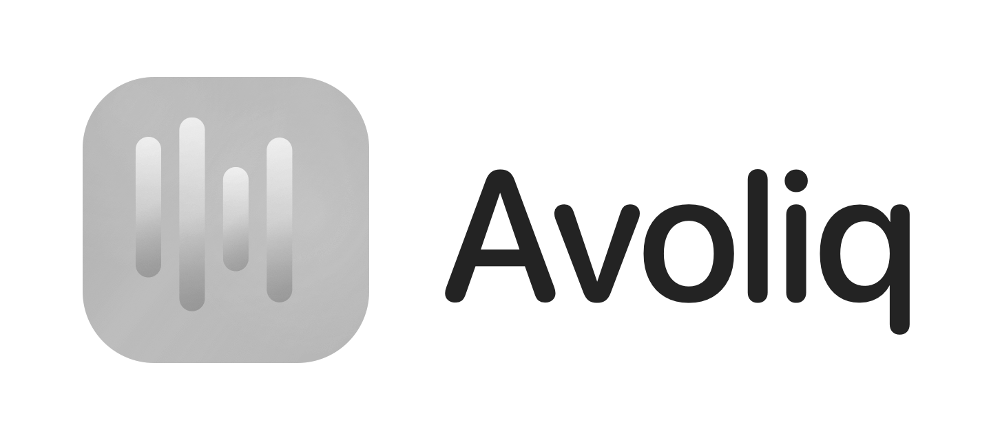

<div align="center">
  
  <p><strong>直感的に、自然に思考を整え、次へ進める。</strong></p>
</div>

# Avoliq

Avoliq（アヴォリック）は、macOS 向けの Spotlight 風タスク管理パレットです。

`Alt + Space` を押すと画面中央に半透明のパレットが現れ、キーボードだけで
タスクの作成・整理・記録ができます。用が済んだら `Esc` で消える。
タスクを増やして管理を強いるのではなく、迷いを減らして目の前の一歩を選びやすくすることを狙っています。

すべてのデータはローカルの SQLite に保存され、外部への通信は一切行いません。

## 主な機能

- **どこからでも呼び出せるパレット** — グローバルホットキー（既定 `Alt + Space`）で最前面に表示。
  Cmd+Tab のウィンドウ循環には現れず、他アプリのフォーカスを奪いません
- **カンバンボード** — ステータス（レーン）ごとにタスクを並べる。ステータスの名前・色・並び順は自由に編集可能
- **キーボード完結の操作** — 移動・ステータス変更・並び替え・削除・復元まですべてショートカット。
  画面下部に現在の画面で使えるキーが常時表示されます
- **その場で検索、その場で作成** — 検索欄に打った文字がそのままタスク名になり、`Enter` 2回で新規作成
  （日本語入力の変換確定と区別するため、作成は2回続けて押したときだけ走ります）
- **タグ** — `⌘K` のタグパレットで付け外し。検索欄で `#タグ名` と打つと絞り込み（候補を `↑` `↓` で選び `Enter` で確定）
- **Markdown 詳細エディタ** — BlockNote による本文編集。入力は自動保存され、パレットを閉じるときに確実に書き出されます
- **複数ボード** — 用途ごとにボードを分けて `⌘B` で切り替え
- **削除の取り消し** — 削除はソフトデリートなので、`⌘Z` で元の位置に戻ります
- **メニューバー常駐 / ログイン時自動起動** — 設定から切り替え可能
- **ライト・ダークの両対応** — システムの外観に追従し、コントラストは WCAG AA 基準で検証済み

## キーボード操作

### ボード画面

| キー | 動作 |
| --- | --- |
| `↑` `↓` `←` `→` | カード間の移動 |
| `Enter` | 詳細を開く（カード選択中） |
| `Enter` `Enter` | 検索欄の文字で新規作成（変換確定との取り違えを防ぐため2回押し） |
| `⌘←` `⌘→` | ステータスを変更 |
| `⌘↑` `⌘↓` | レーン内で並び替え |
| `⌘⌫` | 削除 |
| `⌘Z` | 削除を元に戻す |
| `⌘N` | 新規作成 |
| `⌘P` | 検索 |
| `⌘K` | タグパレット |
| `⌘B` | ボード切替 |
| `⌘,` | 設定 |
| `Esc` | パレットを閉じる |

### 詳細画面

| キー | 動作 |
| --- | --- |
| `⌘←` `⌘→` | ステータスを変更 |
| `⌘T` | タイトルを編集 |
| `⌘K` | タグパレット |
| `⌘N` | 新規作成 |
| `⌘P` | 検索 |
| `Esc` | ボードに戻る |

ボード切替・設定の各画面にも専用のキーがあり、画面下部のヒントに出ます。

## 技術スタック

| 領域 | 採用技術 |
| --- | --- |
| アプリ基盤 | Tauri v2（macOS 専用 / `tauri-nspanel` で NSPanel 化） |
| フロントエンド | React 19 + TypeScript + Vite |
| スタイル | Tailwind CSS v4 + shadcn/ui（Base UI ベース）+ lucide-react |
| 状態管理 | zustand |
| エディタ | BlockNote 0.54.0（バージョン固定） |
| バックエンド | Rust + rusqlite（SQLite 同梱ビルド） |
| テスト | Vitest + Testing Library / `cargo test` |

## 開発環境構築

### 前提

Avoliq は **macOS 専用**です。NSPanel やウィンドウエフェクトなど macOS の
プライベート API に依存しているため、他 OS ではビルドできません。

| 必要なもの | バージョンの目安 | 備考 |
| --- | --- | --- |
| macOS | Tauri v2 の既定に準拠（最小バージョンは明示設定していません） | 動作確認は macOS 26 |
| Xcode Command Line Tools | – | `xcode-select --install` |
| Rust | stable（動作確認 1.93.1） | [rustup](https://rustup.rs/) で導入 |
| Node.js | 22 以降（動作確認 v22.22.0） | nvm 等でのバージョン管理を推奨 |

### セットアップ

```bash
git clone git@github.com:Keisuke-MARs/Avoliq.git
cd Avoliq
npm install
```

### 開発サーバーの起動

```bash
npm run tauri dev
```

Vite の開発サーバー（`http://localhost:1420`）と Rust 側が同時に立ち上がります。

> **初回ビルドについて**
> 依存する Rust クレートを一式コンパイルするため、初回の `tauri dev` は
> 10〜20 分ほどかかり、`src-tauri/target` に数 GB を消費します。2 回目以降は差分ビルドです。

起動してもウィンドウは出ません。**`Alt + Space`** を押すとパレットが現れます
（ホットキーは設定画面 `⌘,` から変更できます）。

### よく使うコマンド

| コマンド | 内容 |
| --- | --- |
| `npm run tauri dev` | アプリを開発モードで起動 |
| `npm run tauri build` | `.app` / `.dmg` を生成 |
| `npm run dev` | フロントエンドのみ Vite で起動（Tauri API は動きません） |
| `npm run build` | 型チェック + フロントエンドのビルド |
| `npm test` | フロントエンドのテスト（Vitest） |
| `npm run test:watch` | Vitest をウォッチモードで実行 |
| `cargo test --manifest-path src-tauri/Cargo.toml` | Rust 側のテスト |

## ディレクトリ構成

```
src/                      # React
  App.tsx / main.tsx / index.css
  types.ts                # 共有型定義
  lib/                    # Tauri invoke ラッパー、純粋なロジック
  store/appStore.ts       # zustand ストア
  hooks/                  # キーボード処理、自動保存など
  components/             # Palette / Board / TaskDetail / TagPalette など
src-tauri/                # Rust
  src/db/                 # 接続・マイグレーション・リポジトリ層
  src/commands.rs         # Tauri コマンド（invoke の受け口）
  src/panel.rs            # NSPanel 化・グローバルホットキー・トレイ
design/                   # ロゴ、アイコン、ステータス色プリセット
docs/superpowers/         # 設計書（specs）と実装計画（plans）
landing/                  # ランディングページ（独立したViteプロジェクト）
```

## データの保存先

| 対象 | パス |
| --- | --- |
| データベース | `~/Library/Application Support/Avoliq/avoliq.db` |

タスク・ボード・タグ・設定はすべてこの SQLite ファイルに入ります。
バックアップはこのファイルをコピーするだけで済みます。

## 開発上の注意

### 配色

色の実値は `src/index.css` のトークン定義ブロック（`--av-*`）にだけ置きます。
shadcn のテーマ変数も BlockNote の変数も、そこを `var(--av-*)` で参照するだけにしてください。

`npx shadcn add` を実行すると `src/index.css` の shadcn テーマ変数が直値で上書きされ、
`var(--av-*)` への参照が失われます。CLI を実行した後は必ず `git diff src/index.css` を確認してください。

また shadcn のレジストリは依存パッケージを宣言しないため、`shadcn add` の後は
`npm run build` を通して未解決の import がないか確かめる必要があります。

詳細は `docs/superpowers/specs/2026-08-21-avoliq-color-system-design.md` を参照してください。

### 設計ドキュメント

`docs/superpowers/specs/` が現行の仕様の正です。`plans/` は実行済みの実装計画で、
歴史的な記録として残しています。

## ライセンス

未定です。
